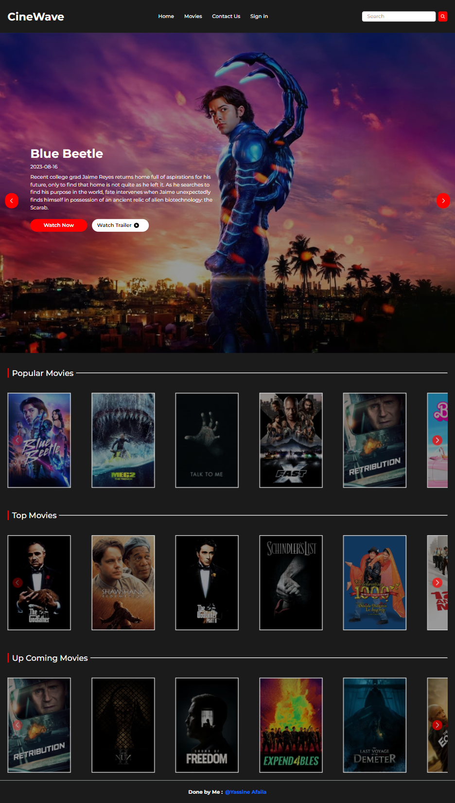
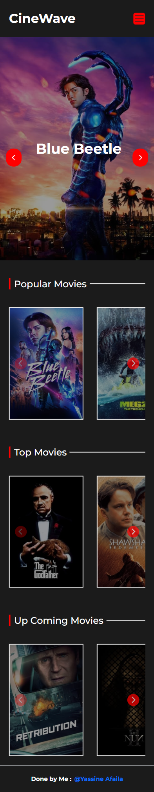
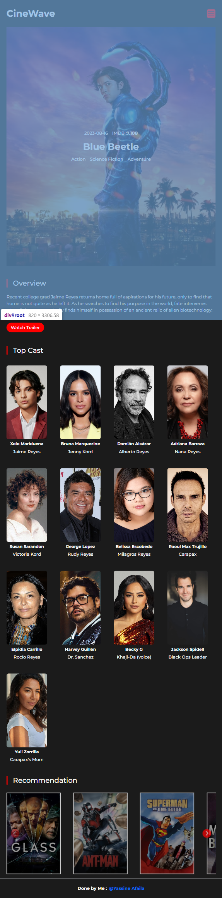

<div id="top"></div>



<div align="center">
  <h1 align="center">Movie App</h1>

</div>


## About <a name = "about"></a>

This project is a web application that allows users to search for movies and view details about them.


## Built Using <a name = "built_using"></a>
- [bootstrap 5](https://getbootstrap.com/docs/5.0/getting-started/introduction/) - CSS Framework
- [React](https://react-redux.js.org/) - State Management
- [React-router](https://reactrouter.com/en/main) - Loading Skeleton
- [Axios](https://axios-http.com/) - HTTP Client
- [SplideJS](https://splidejs.com/) - Carousel
- [framer-motion](https://www.framer.com/motion/) - animation
- [Swiperjs](https://swiperjs.com/react) --Carousel
## Getting Started <a name = "getting_started"></a>

First, run the development server:

```bash
npm run dev
# or
yarn dev
# or
pnpm dev
```

Open [http://localhost:3000](http://localhost:3000) with your browser to see the result.


<p align="right">(<a href="#top">back to top</a>)</p>


